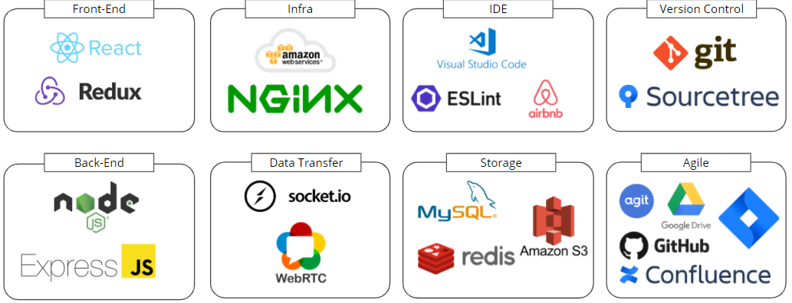

# Connect Class

> 언택트 시대의 스터디에 최적화된 클라우드 기반의 웹 리모트 서비스

[](https://github.com/changicho)
[](https://github.com/kkoon9)
[](https://github.com/SkyLightQP)


## 📌 프로젝트 소개

[
](https://www.youtube.com/watch?v=PY6oroTjOfo&feature=youtu.be)

위 썸네일을 클릭하면 프로젝트 소개 영상을 보실 수 있습니다!

### 프로젝트 이미지


## 👨‍👨‍👧 팀원 소개

|                                 조찬기                                 |                                                      남궁권                                                       |                                                      하대겸                                                       |
| :--------------------------------------------------------------------: | :---------------------------------------------------------------------------------------------------------------: | :---------------------------------------------------------------------------------------------------------------: |
|  |  |  |

### ⚙ 기술 스택



저희 프로젝트는 Front-end는 Typescript, Back-end은 Javascript & Typescript를 사용합니다.

## 🕋 프로젝트 구조

- `front`
  - 프론트엔드 웹 사이트 소스코드
  - 스터디방, 질문 등 구현
- `back`
  - 백엔드 서버 있는 소스코드
  - REST API 및 Socket 관련 구현
  - `/models`에 데이터베이스 모델 구현

### 🗂 폴더 구조

프로젝트의 root는 다음과 같이 구성되어 있습니다.

```bash
├── back   # 백엔드 관련 코드
└── front  # 프론트엔드 관련 코드
```

#### frontend

프론트엔드의 폴더 구조는 다음과 같습니다.

```bash
├── public             # build에 사용할 html등 정적 파일
└── src
    ├── components     # 컴포넌트
    ├── constants      # 사용하는 상수
    ├── pages          # 페이지 컴포넌트 (routing을 위한)
    ├── stylesheets    # 공용 스타일 속성
    ├── asset          # 이미지 파일
    └── Dockerfile     # Docker 파일

```

#### backend

```bash
├──
├── constants     # 사용하는 상수
├── config        # AWS, Database, multer 등 개인 정보를 다룬다.
├── apis          # REST API
├── models        # 데이터베이스 모델
├── services      # 기능을 다룬다.
├── sockets       # socket 기능을 다룬다.
└── stores        # 캔버스 기능에 필요한 store

```

## 🌈 데이터베이스 구조


저희 프로젝트는 mongoDB를 사용합니다.

[mongoDB Database Docs](https://github.com/real-compacted-developer/connect-class/wiki/mongo-db-docs)

## 👨‍💻 실행 방법

frontend에서 사용하는 script 명령들은 다음과 같습니다.

```bash
yarn start # 개발 서버 실행
```

```bash
yarn build # 배포용 파일 빌드
```

```bash
yarn test # 테스트 실행
```

backend에서 사용하는 script 명령들은 다음과 같습니다.

```bash
yarn start # 서버 실행
```

```bash
yarn start:dev # 개발용 서버 실행
```

## 🥴 Support

프로젝트가 마음에 드신다면 Star⭐️를 눌러주세요!
